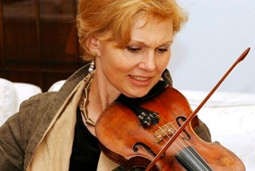

Татьяна Гринденко является исключительным явлением современной русской скрипичной школы. Начала заниматься музыкой с 6 лет в г.Харькове, затем в Санкт-Петербурге и в Центральной музыкальной школе в Москве. В 8 лет сыграла свой первый концерт И.С.Баха с симфоническим оркестром. Закончила Московскую государственную Консерваторию им. П.И.Чайковского.
 

Татьяна Гринденко добилась выдающихся результатов в Международных конкурсах:

- Первая Премия и Золотая Медаль Всемирного Конкурса молодых исполнителей в Софии (1968 г.),
- Лауреат IV Международного конкурса имени П.И.Чайковского в Москве (1970 г.),
- Первая Премия Международного Конкурса имени Г.Венявского в Польше (1972 г.).

С 1978 по 1988 г.г. артистическая карьера Татьяны Гринденко "погружается в молчание": ей были запрещены гастрольные поездки, записи на радио и пластинки. Несмотря на это она создает в 1982 г. первый в России ансамбль "Академия старинной музыки", использующий аутентичную манеру исполнения старинной музыки на оригинальных инструментах. Ансамбль в короткое время получил широкую известность и признание в Советском Союзе.

С 1989 г. Татьяна Гринденко с Академией старинной музыки постоянно приглашается и играет с огромным успехом на международных фестивалях старинной музыки в Бостоне, Глазго, Потсдаме, Стокгольме, Утрехте, Шлезвиг-Гольдштейне, Штириарте, Бремене, Нойшвайштайне, Локкенхаусе, Кортрике, Райнгау, Вене и других. Особый интерес представляет многолетнее творческое сотрудничество Татьяны Гринденко с Гидоном Кремером. Им посвящены "Concerto grosso" N 1 Альфреда Шнитке, "Tabula Rasa" Арво Пярта, последняя композиция Луиджи Ноно "Нау que caminar" sonando. Многие известные композиторы посвящают Татьяне свои работы: В.Артемов, А.Бакши, П.Карманов, В.Мартынов, А.Пярт, В.Сильвестров, И.Соколов, А.Шнитке. Сегодня Татьяна Гринденко ведет активную концертную деятельность как солистка, работает с такими симфоническими оркестрами как Венский Филармонический оркестр, Оркестр Берлинской Филармонии, "Гевандхаус"(Лейпциг), Дрезденская Штаатскапелла, с Симфоническими оркестрами Бруклина, Лос-Анджелеса, Французского Радио, RAT Милана, Турина, Рима, оркестрами Московской и Санкт-Петербургской Филармоний и другими. Ее партнеры по сцене - К.Кондрашин, К.Мазур, Г.Рождественский, Ю.Темирканов, В.Федосеев, В.Ашкенази, Ф.Брюгген, Х.Холлигер, М.Рострапович, В.Афанасьев, Ю.Башмет, Г.Кремер, А.Любимов, А.Менезес, Б.Пергаменщиков, А.Штайер и другие.

В 1997 г. Т.Гринденко с Академией старинной музыки осуществила премьеру оперы Владимира Мартынова "Упражнения и танцы Гвидо" на фестивале "САКРО-АРТ" в г.Локкум в Германии. В 1999 г. она музыкальный руководитель постановки спектакля "Моцарт и Сальери" (музыка - В.Мартынова, режиссер - А.Васильев) в Московском театре "Школа драматического искусства". В 1999г. Татьяна Гринденко основала ансамбль "ОПУС-ПОСТ." cпециально для осуществления проекта "Новое сакральное пространство", в основу которого положена концепция композитора Владимира Мартынова. Суть концепции - это осознание необратимости процесса крушения фундаментальных принципов, служащих базисом композиторской музыки и рождение нового пространства музицирования.

Ансамбль "OPUS-POSTH." - явление абсолютно уникальное в современной российской культуре. Совместно с ведущими художниками видео-арта, поэтами, Ансамблем осуществлены мультимедийные проекты "Бах-2000", "Ночь в Галиции", "Времена года", "Русско-немецкий Реквием", "Игры Ангелов и людей", "Песня песней". В репертуар Ансамбля входят произведения В.Мартынова, А.Пярта, Ф.Гласса, Я.Ксенакиса, А.Кнайфеля, Г.Канчели, С.Гербера, П.Дрешера, Д.Адамса и других.
