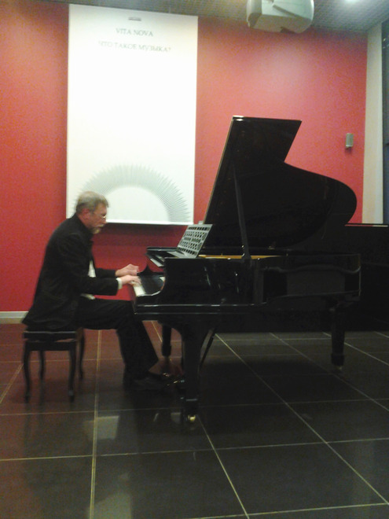

«Мода приходит и уходит, а стиль остаётся», – говаривала великая Коко Шанель.  Сегодня можно с уверенностью утверждать, что композитор Владимир Мартынов стал не только трендсеттером для современного искусства, но  и прочно вошёл в новейшую историю музыки. Цикл встреч с пытливым философом нашего времени – уникальная возможность приобщиться не только к идеям самого Мартынова, зачастую весьма экстравагантных, но и вынести собственную оценку культурным явлениям последних лет. Есть три причины, по которым пропустить это событие нельзя.

Во-первых, Владимир Мартынов – автор не только нашумевшей теории «конца времени композиторов», в своё время взорвавшей музыкальную общественность и расколовшую её на два враждующих лагеря, но и новой художественной хронологии, согласно которой все мы теперь живём в эпоху «опус пост». В рамках цикла автор сам рассказывает о своих исследованиях, книгах и музыкальных произведениях и транслирует свои главные идеи, что, согласитесь, гораздо интереснее, чем пробираться сквозь дебри смыслов одному. С таким харизматичным гидом можно не бояться заблудиться на бескрайних просторах музыкальной истории. Владимир Мартынов – невероятно интересный рассказчик и эрудит широких взглядов. На первой встрече он увлечённо рассказывал о том, что такое музыка вообще, как Пифагор открыл числовые соотношения звуков, и какие виды музыкального минимализма существуют в мире.

__Владимир Мартынов:__ _«Музыка – это гармоническое соотношение человеческого сознания с действительностью, а не то или иное произведение. Согласно пифагорейскому учению  существует три вида музыки: Musica mundana, Musica Humana и Musica instrumentalis, что в переводе означает - мировая музыка, человеческая музыка и инструментальная музыка. Мыслителям пифагорейской школы космос представлялся как прекрасно устроенный музыкальный инструмент, издающий совершенные звуки, которые мы просто не в силах услышать в силу собственного несовершенства. Что же звучит в космосе? Гармоническое соотношение планет.  По Платону четыре стихии – земля, вода, огонь и воздух – соотносятся через музыкальные интервалы, такие как: октава, кварта, квинта и большая секунда. Древние полагали, что звук – это строительная единица космоса. Правильное извлечение звуков приближает нас к возможности услышать музыку космоса»._

Во-вторых, после повествования автор собственноручно исполняет свои произведения, что придаёт этому событию изысканный оттенок эксклюзивности. Ведь нечасто услышишь то или иное сочинение именно так, как его задумывал композитор. Существующие записи всё же не обладают той энергетикой, которую можно почувствовать, только находясь непосредственно в концертном зале. Выступления Владимира Мартынова всегда окутаны атмосферой священнодействия. С этим связан занимательный факт. В 1973 году астрономы предсказывали катастрофу в связи с попаданием нашей планеты в зону кометного хвоста. Чтобы предотвратить коллапс, Мартынов написал произведение «Охранная от кометы Когоутека», которое было исполнено в Союзе композиторов и стало оберегом от конца света. Вскоре жители Земли узнали, что тяготение Юпитера изменило траекторию движения планеты. Посчитав задачу своей необычной пьесы выполненной, композитор сжёг ноты. Погружение Владимира Мартынова в себя и отрешённость от всего суетного во время исполнения своих произведений заставляет внимать им с особым трепетом.

__Владимир  Мартынов:__ _«Сегодня музыка принадлежит к сфере entertainment, но на самом деле музыка – это священнодействие. В древние времена, ещё до Пифагора, в святилищах Вавилона и Египта могли музицировать только посвящённые люди, так как это считалось сакральным действом. У нас имеется семь нот. Вы можете спросить, почему именно семь? Во-первых, это семь астрологических планет. Следовательно, музыка связана с астрологией самым прямым образом. Во-вторых, это семь небес, в-третьих, это семь человеческих чакр. Нажимая ту или иную ноту, мы не просто извлекаем звук, а аппелируем к космическому началу. Это огромная ответственность. Возможно, из-за того, что мы сегодня безответственно позволяем себе музицировать, и случаются все беды современного общества»._

На встрече 19 апреля Владимир Мартынов исполнил своё произведения для фортепиано «Стена-сообщение», написанное им в 2007 году. По мнению композитора _«стена непонимания, необратимо возникающая между человеком и реальностью, — это примета старого, уходящего мира. Грядет новый мир, и в этом таинственном проступании контуров нового мира на обветшалой поверхности старого и заключается суть преображения стены непонимания в стену-общение. Стена превращается в чистую белую поверхность, на которой новая реальность сможет запечатлеть свой знак, и стать этой чистой поверхностью должен сам человек, открытый для восприятия неведомого грядущего»._

Гармоническое поле «Стены-сообщения» представляет собой непрерывную пульсацию минора. Бархатные волны звуков рождают поток сознания. В памяти всплывают последние кадры фильма о Вирджинии Вульф «Часы» и слова из её предсмертной записки: «Всегда годы между нами. Всегда годы, всегда любовь, всегда часы...»  Это неслучайно. Призрак американского минималиста Филиппа Гласса, автора саундтрека к «Часам»,  в произведении Мартынова встаёт неоднократно. Утончённая грусть и тоска по безвозвратно ушедшему чувствуются в этой музыке с первых же нот. Особенным трагизмом наполнен финальный раздел, где звучит напряжённый диалог каденционного оборота и упорно звучащего одинокого звука, который будто пытается пробиться сквозь нагромождения условностей, преодолеть роковую судьбу.  Произведение звучит без малого сорок минут, и ни на миг не прерывается паузами – настоящее испытание на выносливость для исполнителя, из которого Мартынов вышел с честью и достоинством олимпийского чемпиона.

Третья причина для мотивации обязательного присутствия на лекции Владимира Мартынова заключается в следующем. Цикл встреч неслучайно назван «Vita Nova». В 2009 году в Лондонском Royal Festival Holl состоялось первое и единственное исполнение трёхактной оперы Владимира Мартынова «Vita Nova» по мотивам поэмы Данте. Предыстория этого события такова: ещё в начале двухтысячных годов Большой и Мариинский театры, вечно соперничающие за звание главного театра страны, выступили с инициативой и заказали по опере двум современным композиторам. Большой – петербуржцу Леониду Десятникову, сочинение которого ещё долго обсуждала вся культурная общественность. Однако свои обязательства Большой театр выполнил, и постановка «Детей Розенталя» была осуществлена. Мариинка же выбрала москвича Владимира Мартынова, в результате чего родилась опера «Vita Nova», которая по разным причинам до сих пор не дождалась своей полноценной сценической постановки. В этом году композитор задумал осуществить постановку своего детища в Москве, которая и будет представлена в рамках цикла. По признанию самого автора:  _«Это опера про историю оперы как наиболее важного жанра европейской культуры»._

На всех встречах с композитором будут представлены тематические художественные экспозиции современных художников, чьи картины можно приобрести на тихом аукционе. На первом вечере, прошедшем  при поддержке некоммерческого негосударственного учреждения культуры «Галерея Система», демонстрировались масштабные полотна в стиле метафизической живописи Джорджо де Кирико. Мощные фигуры героев картин, выхваченные лучом света из мрака и хаоса, придавали присходящему в зале третье измерение. Они будто желали вырваться из плена холста и устремиться к будущему, предвосхищая время.  

___Елена Кравцун___

[Оригинальная статья](http://www.muzcentrum.ru/news/2012/04/item6230.html)
