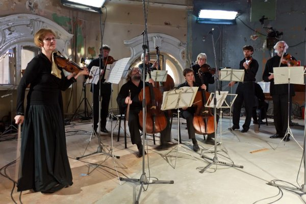

<b>Екатерина Хольм
Классическая музыка - это болезнь</b>

По материалам сайта <a href="http://planeta.ru/planetarium/blog/109409">planeta.ru</a>

<i>В преддверии презентации оперы Vita Nova портал «Планета» встретился с Екатериной Хольм, директором галереи «Система» и автором цикла Vita Nova, в рамках которого проходят встречи с музыкантом Владимиром Мартыновым. Мы поговорили о проблеме популяризации творчества, о смерти классической музыки и о том, что зрители увидят 25 числа в Башне Первой московской телефонной станции. </i>

<figure>
  
  <figcaption>Владимир Мартынов</figcaption>
</figure>

<b>Как возникла идея сотрудничества с Мартыновым? Почему именно он? </b>

Когда я прочла все книги Мартынова, я поняла из писем читателей, адресованных ему, что он жив! Чувство, что есть живой человек, который взялся за труд записать свои мысли о нашем наиинтереснейшем положении вещей в искусстве и в целом жизнеустройстве современного человека, было неразделенной радостью. Конечно, мне немедленно, захотелось услышать его музыку, я заказала диски с сайта, и поняла, что это неразделенная радость стала еще ярче. У меня возникла не идея сотрудничества, а просто острое чувство необходимости поделиться тем, что я услышала и познала с реальным миром, подарить свой опыт другим людям. Можно, это назвать как угодно, гражданским актом, сотрудничеством, но  у меня была такая вот «чесотка на передачу», как назвала это потом Татьяна Гринденко (известная скрипачка, основатель ансамбля Opus Post, жена Владимира Мартынова - Planeta.ru), которая до сих пор в этой «чесотке» пребывает.

Мартынов в какой-то степени стал в моем образе таким музыкальным последователем Кьеркегора и Ницше, и общение с ним просто перевело мое пассивное наблюдение за собой в активное. Все что мы делаем, в конце концов, является самопознанием. Кроме того, что Владимир Иванович сам в себе культурное явление, так он еще и прекрасно шутит, с ним очень легко. Чувство юмора для меня все! Вокруг него собственно и вырисовывается вся картина этого культурного явления.

<b>А почему людям нужен Мартынов?</b>

Мне кажется, нужно помочь им сделать шаг из того виртуального мира, в котором они пребывают. Слова тут недостаточно - все-таки человек воспринимает некими другими органами, нужна музыка, которая говорит сама за себя. Что-то же есть, что доступно Мартынову, что он может передавать, и для этого я и затеяла весь цикл. Я понимаю, что я просто инструмент, ну, инструмент с деньгами и пониманием. Были средства - и я решила это сделать.

<b>Это такая миссия – донести музыку Мартынова до простого человека?</b>

Да нет. При чем тут миссия?! Просто Мартынов – явление действительно исключительное. И сейчас никто другой не мог бы повлиять на тот вакуумно-виртуальный мир, навязанный нашим временем. Можно, конечно, уйти во внутренний мир, но он лишает человека действия, делает аморфным, потому что виртуальность лишает нюха на реальность, хватки, каких-то нормальных инстинктов. Можно читать книги, но одно дело, когда ты читаешь и понимаешь, а другое – когда это как-то входит в тебя. Например, с музыкой. Вот Мартынов в любом своем  произведении возвращает человека к себе.  В его музыке много повторов, как и в любой практике - религиозной, магической - есть элемент возвращения, и настает момент, когда ты начинаешь слушать себя. Методика Мартынова архаична, она глубока, ей много веков. А то, что он делает в опере –  знаменное пение,  григорианский хорал, демонстрирующий нелинейность музыки, - все это погружает человека в другое восприятие времени, в состояние «себя».

И такой музыки сейчас нет нигде. В консерватории сейчас скучно,  пусто. Я человек из музыкальной семьи, слушаю и играю музыку с 5 лет, но меня совершенно туда не тянет. Классическая музыка, которую там исполняют – это болезнь, ответвление от нормальной музыки, потому что она построена по векторному ощущению времени. Человека доводят до изнеможения, до катарсиса, он сидит в своих переживаниях, погружается в экстатическое состояние, и в итоге получает полное опустошение. Это бессмысленно, туда невозможно ходить, да и  зачем – за новыми чувствами, за самообнажением? Классику слушать невозможно. Можно Баха и Моцарта, и то не всё. Я думаю, если поставить эксперимент и исполнить  душераздирающую музыку Рахманинова, Шостаковича, а потом григорианский хорал, вы заметите, как изменится восприятие. Мы так замучены музыкой, мы ее слышим повсюду, в такси, кафе, а ведь это магический акт, раньше она была делом  посвященных, служила гармонизации человека. И у Мартынова есть чистота, без примеси интеллектуального нагромождения на эту радость.

<b>Откуда вдруг возникла эта Башня Первой московской телефонной станции?</b>

Ниоткуда, как всегда. Просто нарисовалась по какой-то закономерности. Я как-то попала  к этому зданию и поняла - вот он, храм искусства! Стоит и разрушается. Там 7 лет  ничего не было, просто руины. Мне очень повезло, что я знала человека, который владеет этим зданием, поэтому подумала: такое здание стоит в центре Москвы, зачем что-то искать и строить специально? Тут даже ремонта делать не надо, просто убрать мусор.

<b>А что с акустикой?</b>

Я думаю, что с не очень дорогой акустической системой это здание может превратиться в новое оперное пространство в Москве. Акустика, правда, сложная: мы рассаживаем зрителей по диагонали - в этом случае они слышат все необходимые вибрации. Внизу нет никакого мусора, очень важно, чтобы там было полое пространство. 11-метровый зал, воздух идет из нижних этажей, нет забитости - мне кажется, это будет лучшим из мест, обладающих такой естественной акустикой.

<b>Давайте поговорим об опере. Ее уже ставили в Англии, но, насколько я знаю, отзывы были не очень хорошими.</b>

Там было только концертное исполнение, но публика как раз приняла постановку на «ура». Не восприняла пресса, но кто такие критики? У зрителей был восторг, но в СМИ это было по-другому освещено.

<b>На какой стадии сейчас находится опера?</b>

На нулевой.

<b>Когда вы планируете ее показать?</b>

Я планирую через год, у Юровского же другие планы. Мы должны выбрать хореографа, потому что там много не драматургического, а именно сценического, режиссера, нужно набрать солистов, которых нет….

<b>…в России?</b>

Да.  Костяк оркестра будет из ансамбля Opus Post, потому что только Татьяна может чувствовать Мартынова. А Володя Юровский, возможно, дополнит его своим лондонским коллективом. Проблем много, но главным будет место, оно и определит все. Оперу невозможно поставить в театре, на сцене, ей нужно только чистое совершенное пространство. Будет место – все сразу быстро соберется. Важно создать ауру, атмосферу, где можно будет репетировать, а сейчас все происходит в каких-то нечеловеческих условиях, коридорах, классах.

<b>Что будет на презентации 25 числа?</b>

Сначала состоится небольшая лекция о том, в каком потоке современности мы сейчас находимся. Я сделаю в этом же зале проекцию миниатюр к Апокалипсису, написанных в XI веке, они отлично демонстрируют тематику нашей реальности и резонируют с куском из оперы «Упражнения и танцы Гвидо». Также будет Юровский, который расскажет о своих постановках, о трудностях, ему можно будет задать вопросы. Это уникальный человек, который первым услышал  Мартынова и первым взялся за постановку.

<figure>
  
  <figcaption>Татьяна Гринденко и ансамбль Opus Post</figcaption>
</figure>

<b>Какое может быть будущее у этой оперы и этой музыки? Это может быть коммерчески успешным проектом?</b>

Нет, конечно. У нас люди привыкли не платить. Если нужно выгулять свои драгоценности в Большой театр – они готовы  отдать большие деньги, потому что это статусное мероприятие. Но это не значит, что они  заинтересованы в постановке - у нас же чистая музыка, никаких регалий, звезд нет. Искусство ради искусства. И это людям не позволяет помочь проекту. В Башню при этом они ходят - она уже воспринимается как модное место, многие хотят туда попасть.

<b>Кому это вообще тогда нужно, кроме вас?</b>

Это нужно многим. Я говорю скорее о финансовой поддержке, об участии. На западе нет такого, что люди не могут позволить себе купить книгу или билет на оперу. А у нас феноменальные люди - интеллигентные, бедные, у них нет денег.

<b>Они не могут за книгу заплатить?</b>

Не знаю, это странно. Я книги всегда отдавала бесплатно, они разбирались мгновенно. На последнем мероприятии решила сделать их платными - никто не покупал. Мне хотелось провести социологическое наблюдение за активностью людей, и я разместила наш проект на <a href="http://start.planeta.ru/campaigns/156">«Планете»</a> - было интересно, сколько мы можем собрать.

Дело в том, что многие думают: раз  «Система» – крупная компания, она может себе это позволить. Возможно, богатые люди своими меценатскими жестами сами приучили публику к пассивности. Но я не понимаю, как можно прийти на концерт и не отблагодарить музыкантов. Есть столько способов и возможностей оплаты на «Планете», и никто не поддерживает.  Проблема с популяризацией творчества Мартынова в том, что он не может о себе рассказать и себя показать - он скромно носит в себе свой внутренний мир. Заказали ему оперу – хорошо, написал, но сам он не будет ее продвигать. Спасибо Татьяне, которая его поддерживает. С другой стороны, если все так происходит вокруг этого произведения – значит так и должно быть.

<i>Презентация оперы Vita Nova состоится 25 октября в 20.00 в Башне Первой московской телефонной станции (Милютинский 5/1).

Купить билет можно по ссылке - http://start.planeta.ru/campaigns/156. В правой колонке акция "Приглашение на вечер 25.10.2012 презентации Оперы "Vita Nova".</i>