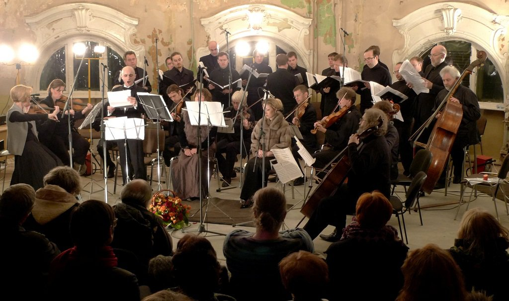

Нерушимый мир искусства, как показывает практика, тоже подвластен веяниям капризной моды. Музыкальный театр как наивысшее достижение человеческой мысли в сфере прекрасного отражает все метаморфозы, происходящие в окружающем нас мире. Минимализм и милитаризм, как главные тренды сезона, сегодня царят не  только на подиумах, но и в современной опере в России.  Экономия выразительных средств в музыке, аскеза в решении сценического пространства, камерность составов и война мнений, бушующая вокруг постановок, доминирующий серый цвет и тоска по героическому прошлому - вот основные составляющие спектаклей последнего времени.  

<figure>
  </img>
<figcaption> Исполнение оперы "Упражнения и танцы Гвидо". Источник фото: <a href="https://www.snob.ru"> www.snob.ru</a> </figcaption>
</figure>

2012 год, в целом, примечателен бурным всплеском общественного внимания к сфере музыкального театра. Вектор задал фестиваль «Золотая маска», под эгидой которого весной состоялся круглый стол «Современному театру – современная опера». Жаркая дискуссия, в которой участвовали известные музыкальные критики, режиссёры и композиторы, стала первой масштабной попыткой осмысления сложившейся ситуации в музыкальном театре. Именно тогда Василий Бархатов впервые заявил об основании "Опергруппы" и создании пилотного проекта -  "Лаборатории современной оперы" при поддержке Министерства культуры РФ. Результатом деятельности этого арт-сообщества уже стало осуществление двух постановок: "Святой Франциск" Сергея Невского в Большом театре и "Сны Минотавра" Ольги Раевой в Театре наций. До конца года нас ждут ещё два спектакля, привлекающих экстравагантностью замысла и сулящих увлекательные аттракционы его воплощения.
 

Другой путь преодоления дистанции между современной академической музыкой и публикой в этом году продемонстрировал композитор Владимир Мартынов. При участии некоммерческого негосударственного учреждения культуры «Галерея Система» был организован цикл встреч, под названием «Vita Nova». Как искусный садовник в оранжерее,  Мартынов постепенно подготавливал благоприятную почву для восприятия своих произведений увлекательными рассказами из истории искусств. Совместно с Татьяной Гринденко и ансамблем Opus Posth он взлелеивал свою аудиторию мастерским исполнением не только собственных сочинений, но и Ксенакиса, Гласса, Кейджа, создавая необходимый культурный контекст и даря бесценный слушательский опыт.
 

Магистральной целью этих встреч изначально было осуществление постановки многострадальной оперы Мартынова по мотивам поэмы Данте «Vita Nova». Для этого впервые в истории современной академической музыки был применён новый маркетинговый инструмент - краудфандинг. Речь идёт о привлечении живых денежных средств для реализации будущего проекта.  Пример цикла «Vita Nova» показал, что сегодня самый эффективный метод - непосредственный контакт со своей аудиторией. Однако в итоге, встречи с Мартыновым и его музыкой создали не только финансовую платформу для постановки оперы, но и сформировали сплочённый круг адептов и почитателей его искусства. 
 

<h3>Семь нот - один Гвидо</h3>
<blockquote>
 <i> «Она была так далека, казалось,
Но улыбнулась мне. И бросив взгляд,
Вновь отвернулась к Вечному светилу»  </i> Данте "Божественная комедия" 
 </blockquote>

 

Перед тем, как с головой уйти в работу над постановкой «Vita Nova», организаторы дали заключительный приём  в Башне на Милютинском переулке. Хотя это экстравагантное место недавно появилось на культурной карте столицы, оно уже привлекает ценителей необычных пространств и экспериментальных арт-объектов, которым чужд традиционный институт концерта. Вот что говорит об этом генеральный директор галереи «Система» <strong> Екатерина Хольм: </strong>  <i>"Я не могу эстетически переносить концерты классической музыки, этой пассивности восприятия в концертном зале, этой искусственности ситуации.  Я не могла слушать музыку лет десять, хотя я - сама музыкант и из музыкальной семьи. Владимир Мартынов развеял это моё состояние категоричным отрицанием авторства. Культ личности композитора, который давит на тебя, заставляет подчиняться, исчезает, его просто нет. Для меня наступило волшебное время, когда я снова смогла слышать и слушать музыку".</i>
 

<figure>  </img>  
<figcaption> Опера "Святой Франциск" Сергея Невского на сцене Большого театра. Источник фото: <a href="https://www.planeta.ru"> https://www.planeta.ru</a> </figcaption>  </figure> 

 

Арктический холод, царивший под сводами первого построенного в Москве небоскрёба, заставлял присутствующих поплотнее запахивать полы своих пальто в стиле милитари и уповать на согревающую силу искусства. "Прекрасный апокалипсис", о котором в своей вступительной лекции вдохновенно вещал Владимир Мартынов, казалось, наступал уже сегодня.  Философ от музыки в своей пламенной речи призывал прекратить "говорить ужасно об ужасном", как это делали весь XX век радикальные композиторы-авангардисты. Мартынов ищет истоки будущей гармонии в искусстве далёкого прошлого, притаившегося в IX-X веках, когда даже Апокалипсис изображали ослепительно красиво и чрезвычайно выразительно. И это не поза, а осмысленная позиция. 
 

<figure> </img> <figcaption>В.Мартынов.Источник фото: <a href="https://www.planeta.ru"> https://www.planeta.ru</a> </figcaption> </figure> 

 

Среди гостей вечера был и известный дирижёр **Владимир Юровский**, который ответственен за первое концертное исполнение оперы «Vita Nova» за рубежом. В ходе лаконичного брифинга маэстро рассказал о своём видении постановки этой "оперы об опере":<i> "С моей точки зрения, это произведение, несмотря на всю монументальность замысла,  - абсолютно камерное. После исполнения «Vita Nova» в Нью-Йорке я понял две вещи: во-первых, эта опера не предназначена для концертного исполнения, оно вредит этому сочинению, во-вторых, публика, исполнители и особенно критики должны по-настоящему готовиться к восприятию этой музыки. В зарубежных драматических театрах существует практика, когда после генеральной репетиции, спектакль идёт две недели, иногда даже до месяца доходит,  - это называют "preview", предварительные показы. На них сгоняют всех, кроме критиков. И потом только играют премьеру. Если бы мне дали карт-бланш, то для «Vita Nova» я бы сделал так же, за исключением одной детали - привёл бы критиков, но запретил бы им писать. Главная цель сегодня - это найти правильное помещение для премьеры оперы. Как и в любой мистерии, в «Vita Nova» нет разделения на участников и публику, все взаимосвязаны.  Вагнер в своё время, когда начал писать свою тетралогию, изначально имел такой план: построить специально для представления театр на берегу Рейна, исполнить "Кольцо" и сжечь этот театр. Для меня идеальная ситуация  - это постановка в рамках фестиваля".</i>
 

<figure> </img> <figcaption> Владимир Юровский.Источник фото: <a href="https://www.planeta.ru"> https://www.planeta.ru</a> </figcaption> </figure>  

 

Для символического прощания с первым сезоном цикла было выбрано концертное исполнение оперы Владимира Мартынова "Упражнения и танцы Гвидо", написанная в 1997 году по заказу немецкого фестиваля "Сакро-арт-97". Герой оперы, Гвидо - своего рода Моисей в музыке. Он пришёл в этот мир, чтобы дать нотацию. Именно ему мы обязаны появлению нотного стана и привычным названиям нот. Однако в понимании Мартынова Гвидо  - этакий анти-Мессия, с которого началась эпоха упадка, время саморазрушения музыки.
 

Суровый колорит григорианского хорала, открывавшего музыкальное действо, как нельзя более соответствовал аскетичности и ироничности помещения. Написанная для хора, солистов и струнного ансамбля с челестой, эта опера создаёт впечатление, похожее на то чувство, когда стоишь перед "Тайной вечерей" Леонардо в Санта-Мария-делла-Грация - вечности.
 

Произведение Мартынова представляет собой любопытный сплав григорианского хорала, барочных арий в духе Генделя и Баха, постромантических каденций и роковых риффов. Мартынов в рамках этого произведения осуществил совмещение веков и стилей в одно музыкальное пространство. В качестве проводников в этом увлекательном путешествии по волнам музыкальной памяти выступили: солисты - харизматичный тенор **Тигран Матинян**, обворожительное меццо-сопрано **Галина Мурадова**, которая участвовала в первом исполнении этого сочинения в Германии, и матовое сопрано Лилия Гайсина, хор **"Мастера хорового пения"** под управлением **Льва Конторовича** и струнный ансамбль **Академии старинной музыки** под руководством **Татьяны Гринденко.**
 

Вслушиваясь в заключительный истаивающий хрустальный пассаж, вдруг понимаешь, что если бы Уолт Дисней захотел снять мультипликационное кино о Гвидо из Ареццо, то музыка Мартынова подошла бы идеально. 
 

<h3>Постлюдия в трёх диалогах</h3>
 

Обычно томное гуляние на afterparty после прослушивания оперы Мартынова обернулось настоящим культурологическим дискурсом. В ходе спонтанно возникавших диалогов выяснялись интереснейшие детали. 
 

Оказывается, увлечение творчеством Владимира Мартынова у современной Надежды фон Мекк, восторженной меценатки **Екатерина Хольм** началось с двух его произведений: "Страстных песен" и "Stabat Mater":<i> "Для себя я поняла, что музыка, написанная Владимиром Ивановичем - это не им написанная музыка, а музыка, которой место быть. Она звучит и будет звучать и так, помимо наших концертов. К ней не надо подходить с позиций, что "эта музыка будет иметь слушателя". Нет. Это мы обретём её, она возвращается к нам. У нашего поколения закрыто сердце, мы боимся боли, боимся любви, боимся всего, а с этой музыкой к нам возвращается понимание всех простых и великих истин".</i>

 
**Владимир Юровский** тоже раскрыл интригу своих отношений с музыкой Мартынова:<i> "Мой роман начался со сценической версии произведения Владимира Ивановича "Плач пророка Иеремии", показанной в девяностые годы в Берлине. Я получил мощное впечатление на всю жизнь, поэтому я хочу, чтобы и оперу «Vita Nova» мы поставили так, что человек, увидевший это, не остался равнодушным".</i> Маэстро считает, что предварительно слушателя надо подготовить для правильного восприятия «Vita Nova» прослушиванием, прежде всего, музыки самого Мартынова, но также и всего багажа, накопленного многовековой историей западноевропейской музыки. 
 

**Владимир Юровский**: <i>"Специфика композиторской техники Владимира Ивановича состоит в создании текста о тексте, музыки о музыке. Основная проблема слушателей, которые пришли на лондонскую премьеру,  - неподготовленность. Они восприняли сладчайшие мелизмы и рулады за чистую монету, не услышав иронического комментария. Мартынов очень прост для восприятия, и это вводит в заблуждение". </i>
 
 

<figure>
 </img> <figcaption> Сопрано Лилия Гайсина.Источник фото: <a href="https://www.planeta.ru"> https://www.planeta.ru</a> </figcaption> </figure> 

 
Мысли, высказанные маэстро, энергично подтверждает **Татьяна Гринденко**, по мнению которой <i>"проект оперы «Vita Nova» просто необходим нынешней российской действительности. У Владимира Ивановича есть уникальное свойство: его музыка буквально источает свет. Этого света в нашей стране так мало, и по климатическим причинам, и по моральным, что ему просто надо дать забрезжить". </i>
 

Все трое сходятся на том, что музыка Мартынова напоминает солнечную сферу и каплю расплавленного золота одновременно. Раскрываясь, она дарит нам тайну далёких светил.
 

На этом, однако, циклы музыкальных тематических вечеров при поддержке галереи "Система" не заканчиваются. О планах рассказала **Екатерина Хольм** в лирическом образе тургеневской барышни: <i>"В ближайших планах у нас вечер, посвящённый музыке американского композитора Джорджа Крама. В течение всего года мы будем проводить репетиции, набирать людей для постановки. Будем бороться с Владимиром Ивановичем, мириться с Владимиром Ивановичем. На февраль запланирована следующая серия встреч на фоне художественных экспозиций. Начинаем "Страстными песнями" Мартынова в исполнении ансамбля Opus Posth. Это очень сильная, обладающая мощной энергией музыка. В ней есть некий имперский тон.  Именно с неё должен начинаться год каждого человека".</i>
 

 <b><i> Материал подготовила Елена Кравцун </i></b>

 