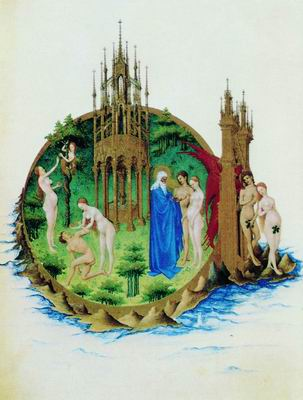
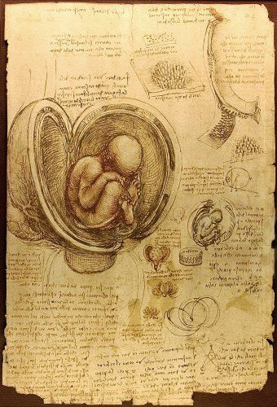
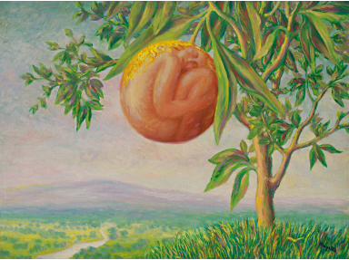
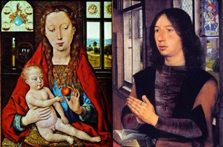
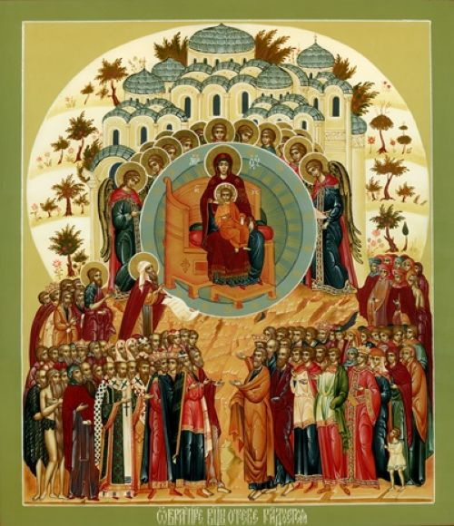
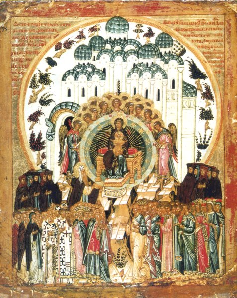
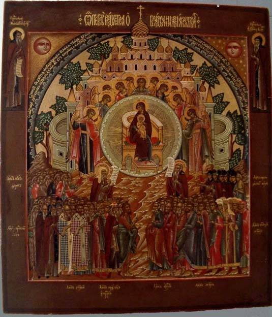
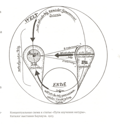
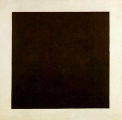

<figure>
  
  <figcaption>"Рай земной" Часослов Герцога Беррийского</figcaption>
</figure>

<figure>
  
  <figcaption>Рисунок Леонардо да Винчи</figcaption>
</figure>

<figure>
  
  <figcaption>"Счастливая Жизнь" Рене Маргитт</figcaption>
</figure>

<figure>
  
  <figcaption>диптих Мартина ван Ньювенхове, Ганс мемлинг</figcaption>
</figure>

<figure>
  
  <figcaption>икона "О тебе радуется"</figcaption>
</figure>

<figure>
  
  <figcaption>Мозаика Купола, Сан Марко</figcaption>
</figure>

<figure>
  
  <figcaption>Пауль Клее</figcaption>
</figure>

<figure>
  
  <figcaption>Рукопись Бл. Августина</figcaption>
</figure>

<figure>
  
  <figcaption>"Черный квадрат" Казимир Малевич</figcaption>
</figure>
